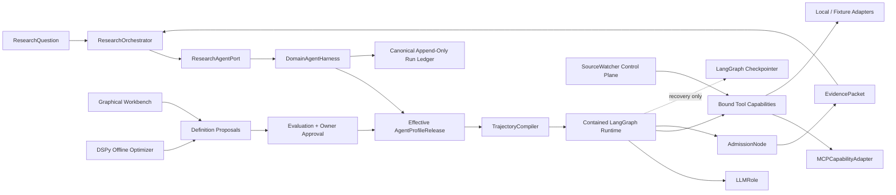
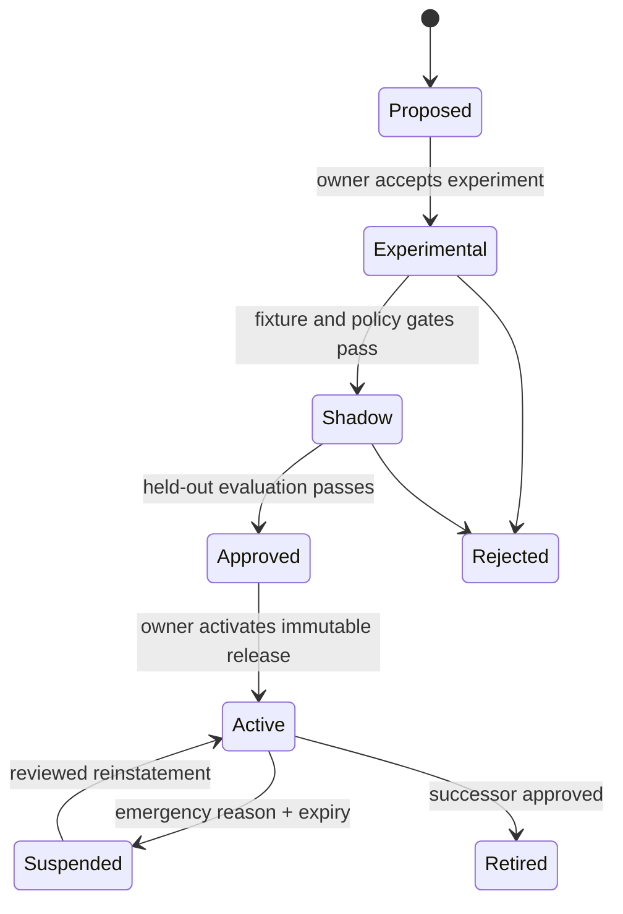
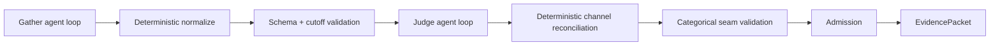
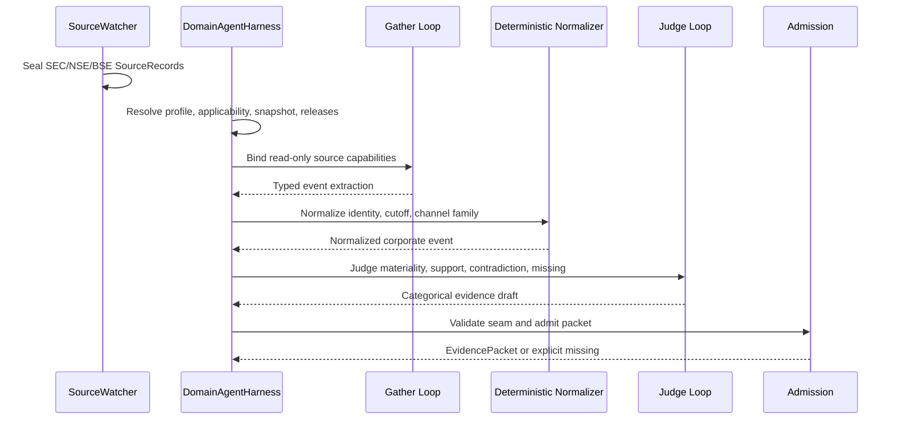

# LLM-Backed Expert Domain Agent Architecture

**Status:** Approved

**Date:** 2026-07-23

**Scope:** Design only. This specification does not activate live semantic influence and does not authorize implementation until the implementation plan is separately approved.

**Research basis:** [Harness research synthesis](../../research/raw/agents/harness-research-synthesis.md), [independent assessment](../../research/raw/agents/independent-harness-assessment.md), and [Hermes MoA assessment](../../research/raw/agents/hermes-moa/harness-assessment.out.md).

## 1. Decision summary

The Trading OS will add one repository-owned `DomainAgentHarness` behind the existing `ResearchAgentPort`. The harness will resolve immutable agent profiles, compile their typed trajectory definitions to a contained LangGraph runtime, and return only admitted categorical `EvidencePacket`s.

The architecture adopts ecosystem components without delegating constitutional authority:

- **LangGraph** executes compiled trajectories and provides recovery checkpoints. Project releases remain the executable source of truth; the append-only run ledger remains canonical audit truth.
- **Deep Agents** is evaluated as a replaceable, bounded implementation of an `AgenticLoopNode`. It is not a second harness and receives no default filesystem, shell, REPL, persistent memory, dynamic MCP discovery, or unrestricted subagents.
- **DSPy** runs offline from the start to propose prompt or module candidates against recorded fixtures. It cannot activate a release.
- **Remote MCP** is supported through a host-owned `MCPCapabilityAdapter` behind the internal capability registry. Models never discover servers or expand their own authority.
- **Pydantic AI, OpenAI, and Anthropic integrations** are candidates behind one provider-swappable `LLMRole` interface. Provider-specific behavior never crosses the harness seam.
- **Hermes Agent and OpenAI Agents SDK** contribute patterns for provider routing, tool registries, hooks, typed results, and observability; neither becomes the policy or evidence authority.

There are ten domain profiles, not ten harnesses. Each profile selects immutable prompts, source coverage, tools, trajectory, model routing, budgets, failure policy, output schema, and evaluation policy.

## 2. Problem statement

The live-V1 safety spine has an intentionally shallow research intelligence layer. A deterministic fake implements the research port, while the system lacks provider routing, governed agent profiles, bounded agentic trajectories, domain tools, source-coverage reconciliation, and a replayable evaluation path.

Adding a general-purpose agent runtime directly would create new and competing authorities for network access, memory, tool execution, state, replay, and policy. The architecture instead needs to make agent research additive: deeper evidence when available, explicit missing evidence when not, and no weakening of the relational champion or the existing execution boundary.

## 3. Goals and non-goals

### Goals

1. Preserve the existing `ResearchAgentPort.investigate(question) -> EvidencePacket | None` compatibility seam.
2. Provide one generic harness for all ten `EvidenceDomain` profiles.
3. Let profiles define bounded typed trajectories containing deterministic nodes between agentic loops.
4. Govern sources, prompts, tools, models, trajectories, evaluations, and activation as immutable desired/observed releases.
5. Support OpenAI and Anthropic initially without encoding either provider into domain logic.
6. Make production runs observable and offline runs deterministic against recorded fixtures.
7. Include LangGraph, DSPy, remote MCP, and a constrained Deep Agents spike without allowing them to bypass project policy.
8. Give non-technical operators a graphical workbench for understanding, simulating, and proposing definitions.

### Non-goals

- Agent-originated orders, positions, quantities, prices, targets, expected returns, or conviction multipliers.
- Direct model browsing, direct model-to-MCP discovery, arbitrary code execution, filesystem mutation, or policy mutation.
- Automatic activation of sources, prompts, profiles, tools, trajectories, or DSPy candidates.
- Removing or subordinating the relational retrieval champion.
- Live economic influence from agent output. That remains separately gated by effective `DecisionFeatureActivation`.
- Ten independently implemented domain harnesses.

## 4. Constitutional constraints

| Constraint | Architectural enforcement |
|---|---|
| No executable number crosses the seam | A mandatory categorical-seam validator rejects price, quantity, target, expected return, position weight, conviction multiplier, and order intent before packet construction. Numeric intermediates remain internal. |
| Admission is mandatory | Every terminal evidence path crosses an `AdmissionNode` calling the existing `admit_packet()`. The orchestrator revalidates the result as idempotent defence. |
| Provider swappable | Domain definitions reference an `LLMRoutingPolicyRelease`; only `LLMRole` adapters know provider APIs. Unsupported capability combinations fail closed. |
| Relational champion permanent | All expected agent failures return explicit missing evidence. `None` is catastrophic only, and neither outcome disables relational operation. |
| Cutoff and snapshot safe | Each run binds its original cutoff, `data_snapshot_id`, source record set, and immutable release closure. Resume and replay cannot silently resolve newer state. |
| Deny by default | The harness injects node-scoped read-only capability proxies. Untrusted source text is structurally separate from instructions and cannot grant tools. |
| Offline deterministic tests | Fixture adapters replace LLM and tool results; clocks, source snapshots, releases, and run identities are frozen. Network and credentials are absent. |
| Cost and observability | Every invocation records release IDs, provider/model, prompt hash, tool hashes, tokens, cost, latency, budgets, cutoff, snapshot, and typed outcome. |

## 5. Top-level architecture



Authority flows from approved immutable releases into a run. Runtime observations flow into receipts and ledger events. No runtime component can reverse that direction and activate its own desired state.

## 6. The one external seam

The existing interface remains unchanged:

```text
ResearchAgentPort
  investigate(ResearchQuestion) -> EvidencePacket | None
```

`DomainAgentHarness` implements this protocol directly. Callers do not see profiles, graphs, sessions, model providers, MCP clients, Deep Agents objects, DSPy programs, checkpoints, or tool registries.

Production and replay use the same caller path:

```text
ResearchOrchestrator -> ResearchAgentPort -> DomainAgentHarness
```

A composition root may construct production or replay dependencies, but it returns `ResearchAgentPort`. Ordinary callers cannot assemble a partially governed harness.

## 7. Desired and observed agent state

### 7.1 Immutable desired state

An `AgentProfileRelease` is a small immutable manifest referencing:

- evidence domain and purpose;
- `TrajectoryRelease`;
- `PromptRelease` set;
- `ToolCapabilityRelease` set;
- `SourceCoveragePolicyRelease`;
- output schema release;
- `LLMRoutingPolicyRelease`;
- run and node budgets;
- `FailurePolicyRelease`;
- `EvaluationPolicyRelease`;
- content hash and effective interval.

The manifest contains references, not provider objects, Python callables, remote URLs, raw prompts, arbitrary expressions, or executable code.

### 7.2 Observed state

Runs produce append-only observations:

- `AgentRunReceipt` and ordered `AgentRunEvent`s;
- source coverage receipts and statuses;
- model/tool usage and failure observations;
- evaluation results;
- definition proposal results;
- admission and terminal outcome.

Observed state may trigger a proposal or alert. It cannot edit or activate desired state.

### 7.3 Release lifecycle



Emergency suspension is time-limited, reason-coded, auditable, and expires to a safe review state. It cannot silently weaken source requirements or grant tools.

## 8. Typed trajectory definitions

`TrajectoryRelease` is the source of truth for both execution and workbench rendering. It contains:

- immutable release and content hashes;
- typed input and output schema IDs;
- registered nodes and typed ports;
- explicit edges and conditions;
- terminal nodes;
- run bounds;
- failure routing.

Allowed initial node kinds are:

1. bounded agentic loop;
2. deterministic transform;
3. schema validation;
4. branch;
5. bounded fan-out;
6. join;
7. judge;
8. categorical-seam validation;
9. admission;
10. explicit missing.

Definitions may reference only registered, versioned node kinds. They cannot embed Python callables, LangGraph runnables, model-native tools, MCP endpoints, arbitrary expressions, or uploaded code.

Every agentic node declares maximum turns, tokens, cost, elapsed time, tool calls, fan-out, subagents, and subagent depth. Every cycle crosses a monotonic budget gate. The compiler rejects an unbounded cycle or a terminal path that avoids categorical validation and admission.

### 8.1 Compiler and runtime split

`TrajectoryCompiler` validates release closure, typed edge compatibility, node registration, capability grants, output restrictions, budgets, and terminal completeness. Its output is an opaque project-owned `CompiledTrajectory`.

`TrajectoryEngine.execute(compiled, invocation)` is the only runtime operation. The concrete implementation privately creates and invokes LangGraph objects.

LangGraph state never becomes the public definition. This preserves framework replaceability and lets the workbench render the exact definition operators approve.

### 8.2 Deterministic nodes between loops



This is the standard shape for P0 corporate events. Other profiles may select different registered trajectories while using the same harness and engine.

## 9. Canonical ledger and LangGraph checkpoints

LangGraph checkpoints exist only to resume execution efficiently. The canonical append-only ledger records externally meaningful truth:

- resolved release closure;
- question, cutoff, snapshot, applicability, and source IDs;
- node start, finish, retry, failure, and terminal transitions;
- hashes of typed node input/output artifacts;
- provider/model identity, prompt hash, tokens, cost, and latency;
- capability release and request/result hashes;
- budget transitions;
- admission result and terminal compatibility mapping.

Nodes cannot write ledger events. The harness wraps node execution and emits events before and after it. Resume reconciles checkpoint state with the ledger. A disagreement fails closed as catastrophic infrastructure failure; the checkpoint never overwrites canonical events.

Replay binds the original release closure and recorded model/tool results. It does not re-fetch sources or resolve a newer active profile.

## 10. Provider-neutral `LLMRole`

The interface is conceptually:

```text
LLMRole.invoke(StructuredInvocation[T]) -> StructuredResult[T] | ExpectedLLMFailure
```

The request contains an immutable role and prompt release, trusted context, references to untrusted source records, output schema, invocation budget, and replay key. Provider model names are resolved by the routing release rather than selected by trajectory code.

The result contains typed output or a typed expected failure plus provider/model identity, usage, finish reason, validation status, latency, and trace correlation.

Adapters hide:

- OpenAI, Anthropic, Pydantic AI, and fixture-model formats;
- schema negotiation and validation;
- capability checks;
- retry and fallback classification;
- usage normalization;
- provider tracing suppression and redaction.

Hosted/server web, fetch, code-execution, memory, file-search, and provider-owned agent tools are disabled for domain runs. A provider feature is unavailable until it earns an owned typed representation and passes the common contract suite.

## 11. Agentic loop strategies and Deep Agents

The internal seam is:

```text
AgenticLoopStrategy.run(BoundedAgentLoopRequest[T]) -> AgentLoopResult[T]
```

Two implementations justify the seam:

- a minimal provider-neutral structured tool loop;
- a candidate `BoundedDeepAgentsStrategy`.

Deep Agents may be activated for a node only after its spike proves:

1. filesystem mutation, shell, sandbox `execute`, REPL, persistent memory, default general-purpose subagent, and dynamic MCP discovery are absent;
2. every declared or dynamic child receives an explicit immutable capability set rather than relying on inherited middleware;
3. outer-harness budgets remain authoritative;
4. all model and tool boundaries flow through metered project facades;
5. typed output and offline transcript replay are deterministic;
6. failure mapping remains compatible with `EvidencePacket | None`.

Failing a gate leaves Deep Agents as a pattern source. No public interface or release schema changes.

## 12. Tool capability model

`ToolCapabilityRegistry.bind(binding)` returns node-scoped `BoundCapabilities`. The model sees only sanitized typed tool descriptions and invokes only those proxies.

Each `ToolCapabilityRelease` defines:

- stable capability and implementation version;
- input and output schemas;
- purity/read-only classification;
- allowed evidence domains and profile releases;
- required snapshot scope and source classes;
- time, result-size, and resource limits;
- fixture adapter;
- failure mapping;
- citation behavior.

The effective authority is the intersection of:

```text
profile allowlist
∩ node allowlist
∩ capability release
∩ source applicability
∩ frozen snapshot scope
∩ server/network policy
```

No capability grants network browsing, arbitrary filesystem access, process execution, policy mutation, definition activation, or trading authority.

## 13. Remote MCP containment

Remote MCP is an active transport option, not a trust boundary. `MCPCapabilityAdapter` sits behind `ToolCapabilityRegistry` and binds:

- approved immutable server identity;
- frozen tool name, description, and input/output schema;
- audience-bound credentials;
- explicit network egress allowlist;
- snapshot scope;
- timeouts and result-size limits;
- local request/result validation;
- fixture/replay adapter.

The model cannot call `tools/list`, choose endpoints, accept new tools, or react to `listChanged`. Remote annotations are treated as untrusted metadata. OAuth token passthrough is prohibited. Server identity drift, schema drift, new tool advertisement, audience mismatch, oversized output, or citation escape fails closed and becomes a typed tool failure.

Remote MCP may expose read-only computation or access to an already frozen evidence snapshot. Fetching a new SEC, NSE, or BSE record remains `SourceWatcher` work and must first produce a sealed `SourceRecord`.

This follows MCP's own warning that tool annotations are not inherently trusted and its prohibition on token passthrough. See the [MCP tools specification](https://modelcontextprotocol.io/specification/2025-06-18/server/tools) and [authorization specification](https://modelcontextprotocol.io/specification/2025-06-18/basic/authorization).

## 14. SourceWatcher as a governed control plane

Agents never browse or fetch. `SourceWatcher` adapters ingest official channels and seal immutable records before any agent run.

### 14.1 Desired state

`SourceCoveragePolicyRelease` declares effective-dated source applicability, mandatory and optional channels, poll cadence, freshness, parser release, legal/entitlement constraints, and degradation rules.

### 14.2 Observed state

`SourceCoverageReceipt` records intended, attempted, captured, omitted, delayed, invalid, and contradictory channels plus timestamps, snapshot IDs, and adapter/parser releases. A deterministic reconciler produces `SourceCoverageStatus`.

### 14.3 Evolution over time

- operators, monitors, and agents may propose a source;
- a new source begins `EXPERIMENTAL` and runs shadow-only;
- provenance, legal entitlement, freshness, parser accuracy, independence, failure, and replay gates must pass;
- an owner approves an immutable source policy release;
- activation changes desired state; receipts then show whether actual coverage converges;
- missing or stale high-signal resources create alerts and proposals, never self-promotion.

This makes source discovery continuous without allowing the watcher or an agent to silently broaden the evidence surface.

## 15. Applicability, degradation, and contradiction

Mandatory source sets derive from effective-dated issuer, listing, security, product, and filing relationships at the decision cutoff.

- NSE-only security: absence of BSE is not degradation.
- BSE-only security: absence of NSE is not degradation.
- Dual-listed security: one applicable exchange absent is degraded but usable.
- SEC is mandatory only when filing status and issuer/security relationships make it applicable.
- Specialized sources become applicable only through an effective-dated relationship, such as a mapped drug/product relationship for a pharmaceutical issuer.
- One applicable official channel missing while another succeeds is degraded but may remain usable.
- All mandatory primary channels missing yields explicit insufficient evidence with no positive influence.
- Materially conflicting applicable official channels preserve all citations and yield contradictory evidence with no positive influence until deterministic resolution or correction.
- Multiple exchange or SEC deliveries of the same issuer disclosure improve delivery coverage but are not independent corroboration.

## 16. Failure compatibility

The harness is logically total for expected failures:

| Condition | Compatibility result |
|---|---|
| Provider timeout, refusal, unsupported capability, or malformed output | Admitted explicit missing packet |
| Tool timeout, unavailable adapter, schema failure, or MCP drift | Admitted explicit missing packet |
| Budget exhaustion | Admitted explicit missing packet |
| Incomplete applicable source coverage | Degraded or missing packet per policy |
| Official-source conflict | Contradictory packet |
| Profile or trajectory unavailable | Admitted explicit missing packet |
| Categorical seam violation | Admitted explicit missing packet plus safety event |
| Canonical ledger unavailable or corrupt release closure | `None` with catastrophic observability |

If a terminal ledger append cannot be committed, the harness cannot return positive evidence. The relational champion continues for every outcome.

## 17. DSPy evaluation and definition evolution

DSPy is part of the initial offline evaluation workstream. It may optimize typed signatures, prompts, demonstrations, or bounded modules against recorded fixtures.

Initial corporate-event metrics include:

- output schema validity;
- citation-scope validity;
- claim-to-source entailment;
- applicable-source completeness;
- cutoff safety;
- contradiction preservation;
- correct abstention and degradation;
- prohibited executable-field rejection;
- token, cost, and latency budgets.

Training and held-out fixture families must be separated by issuer and event family to reduce shortcut learning. Abstention, contradiction, and cutoff metrics are hard floors rather than values an aggregate score may trade away.

DSPy produces a `DefinitionProposal` with parent release, candidate content, optimizer release, fixture sets, metrics, held-out results, and provenance. It cannot write the active registry. Compilation, evaluation, owner approval, and a new immutable release are mandatory for promotion.

Source: [DSPy official documentation](https://dspy.ai/).

## 18. Ten domain profiles

All profiles use the same harness. The table defines the initial purpose and high-value capability families. The research-backed starting source classes, typed tools, reasoning skills, good-packet criteria, and fail-closed traps for every profile are specified in [Domain Agent Source, Tool, and Skill Profiles](../../research/18-domain-agent-source-tool-profiles.md); effective access still requires immutable source-policy and capability releases.

| Domain | Purpose | Initial capability families | Mandatory output emphasis |
|---|---|---|---|
| `technical` | Interpret price/volume structure without creating a trade instruction | adjusted-bar reader, corporate-action adjustment check, regime/indicator calculators | categorical trend/regime, data-quality caveats, no targets |
| `fundamental` | Assess reported operating and balance-sheet evidence | SEC/XBRL and exchange-filing span queries, accounting-ratio calculators, period comparators | reported-vs-derived distinction, period/vintage, missing fields |
| `corporate_event` | Classify material official announcements and consequences | SEC 8-K/6-K reader, NSE/BSE announcement reader, identity/applicability resolver, event normalizer | event category, materiality class, contradictions, channel coverage |
| `sentiment` | Detect narrative risk only | source-family deduplicator, provenance classifier, risk-theme extractor | risk-only eligibility effect, syndicated-copy caveat |
| `macro` | Assess macro state and release surprises | official release-calendar/vintage reader, series transformations | vintage and revision status, categorical regime, cutoff |
| `economic_relationship` | Evaluate issuer, sector, supplier, commodity, and currency relationships | temporal relationship-graph query, exposure evidence reader | relationship validity interval and transmission uncertainty |
| `governance` | Assess governance disclosures and control risk | board/ownership/related-party filing queries, action history | governance risk, effective dates, unresolved allegations |
| `liquidity` | Characterize execution-environment risk without sizing | spread/depth/volume-quality probes, feed-entitlement check | categorical liquidity risk and data entitlement caveat |
| `portfolio` | Identify portfolio-level evidence and constraint interactions | exposure/overlap/concentration readers, scenario aggregators | categorical concentration/correlation risks, no weights or orders |
| `market_mechanics` | Interpret venue, session, halt, auction, and corporate-action mechanics | exchange status/calendar/halt readers, symbol/action resolver | market-state constraints and invalid-data warnings |

Sentiment remains risk-only. Portfolio and liquidity profiles cannot emit sizing. Technical analysis cannot emit price targets or trade signals. Every profile's citations remain a subset of `ResearchQuestion.source_record_ids`.

## 19. P0 corporate-event tracer

P0 proves the entire vertical slice using recorded SEC 8-K fixtures and NSE/BSE announcement adapters.



The P0 fixture matrix includes:

- NSE-only complete;
- BSE-only complete;
- dual-listed complete;
- dual-listed one-channel degraded;
- SEC-applicable complete;
- SEC-not-applicable without degradation;
- all mandatory channels missing;
- materially conflicting official records;
- late record beyond cutoff;
- duplicate/same-origin channel deliveries;
- malformed provider/tool output;
- budget, timeout, and catastrophic ledger failures.

## 20. Scheduler integration

The scheduler continues to describe work. A runner resolves due jobs to a question and active immutable release closure, then calls the unchanged research port. The scheduler does not compile trajectories, choose models, discover tools, activate definitions, or interpret evidence.

Retries are idempotent by deterministic run identity and ledger reconciliation. A retry cannot widen source scope, use a newer release, or repeat a non-idempotent external operation. Live source collection remains a separate `SourceWatcher` schedule.

## 21. Graphical workbench and great-UX action item

The workbench is a non-technical projection and proposal surface over the same immutable definitions used by execution.

It must visually show:

- desired versus observed state;
- source lifecycle and coverage reconciliation;
- effective applicability by issuer/security/listing/filing relationship;
- profile manifest and referenced releases;
- trajectory nodes, typed edges, deterministic steps, loops, fan-out/join, budgets, and terminal outcomes;
- tool permissions and remote MCP containment;
- admitted, degraded, contradictory, insufficient, missing, and catastrophic outcomes;
- the final categorical evidence seam and permanent relational champion.

Users may compose a draft profile or trajectory, inspect validation errors, run a frozen-fixture simulation, compare results, and submit a proposal. They cannot activate it directly.

Frozen fixtures are the default simulation mode. A later live preview must be prominently labeled non-reproducible and cannot feed trading, evaluation promotion, or activation automatically.

**Great-UX action item:** before production rollout, conduct a dedicated operator-centered design cycle with non-technical users. Success means an operator can answer “what should happen, what actually happened, why is this degraded, and what can I safely propose next?” without reading code, raw JSON, framework traces, or provider logs.

## 22. Testing strategy

Tests use the highest stable seam: `ResearchAgentPort.investigate()` through `ResearchOrchestrator`. Internal contract suites are added only where two real adapters justify a seam.

### Required contract suites

- `LLMRole`: OpenAI, Anthropic, Pydantic/fixture behavior for structured output, refusal, timeout, malformed output, usage, and unsupported capabilities.
- `TrajectoryEngine`: compile validation, typed edges, bounds, terminal completeness, crash/resume, checkpoint/ledger reconciliation, and replay.
- `AgenticLoopStrategy`: minimal loop and Deep Agents capability parity, budgets, child grants, typed output, and fixture replay.
- `ToolCapabilityRegistry`: local, fixture, and remote MCP identity/schema/scope/failure behavior.
- Source coverage: effective-dated applicability, degradation, contradiction, emergency suspension, and experimental/shadow sources.
- Compatibility seam: every expected failure maps to an admitted packet and only catastrophic infrastructure maps to `None`.

### P0 proof obligations

1. Identical releases, snapshot, fixtures, and clock produce identical packet and ledger.
2. Resume at every node boundary neither duplicates work nor changes evidence.
3. No non-allowlisted capability reaches a provider or adapter.
4. Remote MCP rejects identity drift, schema drift, `listChanged`, unapproved tools, audience mismatch, token passthrough, and oversized results.
5. Deep Agents parent and child loops see only explicit immutable capability proxies.
6. DSPy improves held-out quality without weakening abstention, contradiction, cutoff, or executable-field floors.
7. Source applicability handles NSE-only, BSE-only, dual-listed, and SEC status correctly.
8. The relational champion remains available for missing, degraded, contradictory, and catastrophic agent outcomes.

## 23. Rollout

### P0 — governed corporate-event tracer

- freeze release schemas and the one-method compatibility adapter;
- compile the corporate-event trajectory to LangGraph;
- add recorded SEC 8-K and NSE/BSE adapters/fixtures;
- implement the minimal loop, provider adapters, capability registry, ledger, admission path, and offline replay;
- run bounded spikes for Deep Agents, remote MCP, Pydantic AI, and DSPy;
- keep all agent output shadow-only.

### P1 — remaining profiles and MoA trajectories

- add the other nine profile releases and their official-source policies;
- add gatherer/judge fan-out/join trajectories within the same harness;
- activate approved remote MCP capabilities where a real adapter benefit exists;
- expand DSPy evaluation and held-out fixture families;
- deliver the graphical workbench proposal and simulation flows.

### P2 — calibration and controlled promotion

- calibrate domain evidence against forward outcomes without optimizing away safety floors;
- measure incremental value over the relational champion;
- approve narrowly scoped `DecisionFeatureActivation` only through a separate architecture and governance decision;
- preserve immediate rollback to relational-only operation.

## 24. Risk register

| Risk | Leading indicator | Control |
|---|---|---|
| Cost blowup | budget exhaustion, fan-out growth, cache miss rate | hard per-node/run budgets, cheap gatherers, bounded fan-out, prompt caching where safe, kill switches |
| Prompt injection | source text alters tool intent or output schema | trusted/untrusted structural separation, capability proxies, no side effects, strict typed output, adversarial fixtures |
| False-alpha belief | positive evidence from weak or correlated sources | official-source policies, provenance families, contradiction gates, shadow evaluation, relational benchmark |
| Provider lock-in | profile depends on hosted tools or provider-only schema behavior | `LLMRole` contract suite, provider capability compilation, owned types, fixture adapter |
| LangGraph state becomes authority | checkpoint and ledger disagree | ledger canonicality, reconciliation, fail closed, recovery-only retention |
| Deep Agents authority leakage | child gains default tools or memory | explicit child grants, stripped middleware, outer budgets, spike pass/fail gate |
| MCP schema/server drift | runtime tools differ from release | pinned identity/schema, ignore discovery changes, local validation, frozen fixtures |
| DSPy overfitting | train improvement with held-out safety regression | issuer/event-family split, hard safety floors, proposal-only output, owner approval |
| Data entitlement gap | required source unavailable legally or operationally | policy applicability, entitlement metadata, degraded/missing outcomes, alternative approved sources |
| Latency misses decision window | p95 run exceeds domain TTL | domain budgets, asynchronous precomputation, small trajectories, explicit missing rather than late evidence |
| Source blind spot | important event appears outside active policy | coverage receipts, proposal monitor, experimental shadow adapters, owner-approved releases |
| UX misinterpretation | operator mistakes observed state for active policy | desired/observed visual separation, plain-language statuses, simulation labels, activation gate |

## 25. Hard-to-reverse decisions requiring ADRs

1. The repository owns the generic harness and immutable definitions; LangGraph is a contained execution substrate.
2. `LLMRole` is the provider-abstraction seam and provider-specific features fail closed unless represented in owned types.
3. Domain research uses profile-selected typed trajectories, including MoA gather/judge patterns, within one harness.
4. Tools are node-scoped read-only capabilities; remote MCP is only a pinned host-controlled adapter.
5. The append-only run ledger is canonical; framework checkpoints are recovery projections.
6. DSPy is proposal-only and Deep Agents is a gated loop strategy rather than a second harness.

## 26. Acceptance criteria for implementation planning

- All eight constitutional constraints have an explicit enforcement point.
- The existing research seam and relational champion remain unchanged.
- One harness supports all ten profiles through immutable definitions.
- LangGraph, DSPy, remote MCP, and Deep Agents have bounded present-tense roles.
- SourceWatcher evolves through desired/observed policy, receipts, and owner-approved source releases.
- Single-exchange applicability does not create false degradation.
- P0 is a complete recorded SEC/NSE/BSE corporate-event tracer.
- Tests are offline-first, compatibility-level, and TDD-shaped.
- The workbench has a dedicated non-technical UX deliverable and cannot activate drafts.
- ADRs record the hard-to-reverse decisions before implementation.
