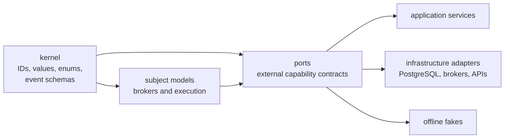
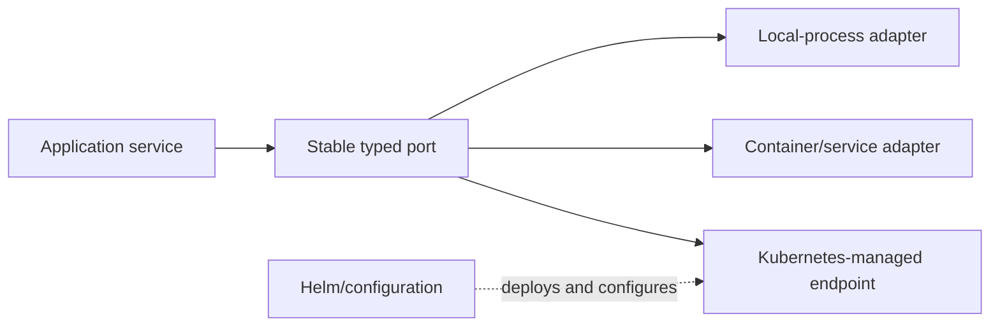
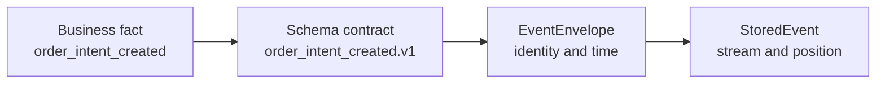
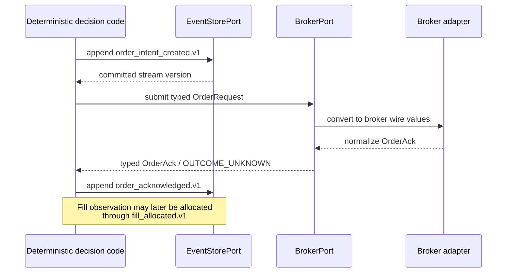
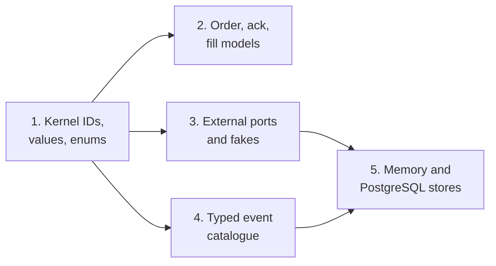

# WS-1 Kernel Value-Objects and Event Catalogue Hardening

**Status:** Review requested

**Date:** 2026-07-23

**Scope:** Design only. This specification covers V1 Tasks 2, 4 (types only), 5,
and 6 through WS-1 in `docs/V1-LEDGER.md`. It does not authorize implementation.

## 1. Authority and decision summary

This specification is governed, in order, by:

1. `docs/V1-LEDGER.md`, especially §§4, 5, and 7;
2. the accepted ADRs and approved subsystem specifications;
3. `CONTEXT.md`;
4. the original V1 implementation plan as superseded design input only.

WS-1 will harden the existing kernel and its immediate consumers in place. It
will not create a parallel domain package or restore the superseded global
architecture.

The result will provide:

- frozen, type-distinct, string-wire-compatible identifier value objects;
- strict finite-`Decimal` money, price, and quantity types;
- one closed vocabulary for shared execution states and order states;
- canonical immutable order, acknowledgement, and fill models;
- one package of small protocols for external capabilities;
- a closed, typed, schema-versioned operational-event catalogue;
- one event-store contract implemented by the existing PostgreSQL store and a
  deterministic in-memory store.

Because the system has never run, this is a clean internal cutover. There is no
legacy event decoder, compatibility alias, deprecated import path, duplicate
numeric representation, or data-migration period.

## 2. Observed starting point

The current repository already contains a coherent reduced safety spine:

- `kernel/ids.py` uses `NewType` string aliases;
- `kernel/values.py` has integer-minor-unit `Money` and Decimal `Quantity`;
- `kernel/events.py` accepts free-form event names and arbitrary dictionaries and
  obtains time from the system clock;
- `brokers/models.py` uses raw strings and integer executable values and lacks a
  canonical `Fill`;
- external protocols are scattered across broker, market-data, ontology, agent,
  and research packages;
- the PostgreSQL event store already provides expected-version append, ordered
  replay, and event-ID idempotency;
- execution already writes intent before broker side effect;
- account-partitioned portfolio projections, account-generation kill state, and
  CAS-row-keyed reservations are shipped architecture.

This work therefore strengthens existing seams. It does not replace the safety
spine or invent a second one.

## 3. First principles and invariants

### 3.1 One concept, one authority

A concept must have one canonical representation inside the process. Parallel
raw and typed fields invite disagreement and make static checking ineffective.

### 3.2 Parse at the boundary, trust inside

Network, broker, database, environment, and fixture representations are parsed by
adapters. Domain code receives validated objects and does not repeatedly
reinterpret raw strings, integers, or floats.

### 3.3 Deterministic code owns executable numbers

No executable number crosses the categorical evidence seam. Money, prices, and
quantities use fixed-point `Decimal`; binary float remains confined to
statistical arrays and is converted explicitly at their boundaries.

### 3.4 Facts are immutable; ordering belongs to storage

An event describes a fact. Its account stream and committed position are storage
facts assigned atomically by the event store. The caller cannot claim a committed
stream position.

### 3.5 Compatibility describes meaning, not time

Event schema versions are semantic `v1`, `v2`, and so on. Business and recording
timestamps remain separate. A timestamp cannot establish whether two payload
shapes are compatible.

### 3.6 Preserve settled architectural divergences

WS-1 must preserve:

- `AccountPortfolioSnapshot` and `OwnerPortfolioCut`, never a global portfolio;
- account-scoped, monotonically generated kill state, never a global flag;
- reservation rows keyed by `(account_id, cas_version)`, never event-sourced
  reservation ownership;
- the categorical LLM evidence seam and deterministic numeric authority;
- two-broker/two-market V1 scope.

## 4. Goals and non-goals

### Goals

1. Make invalid identifiers, numeric values, orders, fills, and operational
   events unrepresentable at their model boundaries.
2. Give downstream workstreams stable kernel vocabulary.
3. Make event creation and replay deterministic and closed to arbitrary payloads.
4. Make production adapters and offline fakes conform to the same small external
   capability contracts.
5. Preserve the existing operational schema and architecture while replacing
   incomplete Python types atomically.

### Non-goals

- Recovery workflow implementation or new runtime orchestration.
- Global portfolio, global kill, or event-sourced reservation models.
- Database data migration or historical event conversion.
- Kubernetes, Docker, Helm, deployment topology, service discovery, or secrets
  infrastructure.
- New live broker, market-data, graph, notification, or HITL integrations.
- SourceWatcher evolution, source-discovery policy, or changes to the domain
  agent harness.
- New LLM authority or any executable numeric output from research.

## 5. Module boundaries



Canonical locations are:

```text
src/trading_os/kernel/ids.py
src/trading_os/kernel/values.py
src/trading_os/kernel/events.py
src/trading_os/kernel/event_payloads.py
src/trading_os/brokers/models.py
src/trading_os/ports/
src/trading_os/execution/kill_state.py
src/trading_os/execution/protection.py
src/trading_os/ledger/store.py
src/trading_os/ledger/memory.py
tests/fakes/ports.py
```

The kernel imports no broker, persistence, framework, deployment, portfolio,
policy, or accounting module. Event payloads contain stable facts expressed with
kernel types, not serialized aggregate models.

Internal strategy and subsystem contracts such as `ResearchAgentPort`,
`TrajectoryEngine`, `SourceWatcher`, `SourceFetchPort`, `SeenRecordStore`,
`OpportunityDetector`, and the run-ledger contract stay beside their owning
subsystem. The unified `ports/` package is for the thirteen cross-system
infrastructure capabilities, not every use of `Protocol`.

## 6. Identifier value objects

The canonical identifier roster is:

- `AccountId`
- `InstrumentId`
- `SnapshotId`
- `ValidatedDataSnapshotId`
- `SemanticSnapshotId`
- `ReleaseId`
- `EventId`
- `TenantId`
- `IntentId`
- `StrategyBookId`
- `PositionEpisodeId`

Every identifier is a frozen Pydantic string-root value object with:

- `.parse(text)` for an existing non-empty canonical identifier;
- `.new()` producing stable UUID text;
- string JSON and database representation;
- stable hashing;
- equality only with the same identifier class;
- rejection of blank, surrounding-whitespace, and non-string values.

The internal API does not compare an ID equal to a raw string. Adapters use
`str(identifier)` or the canonical serializer explicitly.

String-root representation is chosen because current account, instrument, and
release identities include meaningful external text, while wire and database
columns are already strings. A UUID-only object would incorrectly reject valid
external identities; bare string aliases would not provide runtime separation.

## 7. Numeric and state vocabulary

All models are frozen Pydantic v2 models with `extra="forbid"` and finite strict
Decimal validation.

### 7.1 Numeric value objects

`Money` contains:

- `amount: StrictDecimal`, signed and finite;
- `currency: Currency`.

Addition and subtraction require the same currency and otherwise raise a
currency-mismatch domain error before arithmetic.

`Price` contains:

- `value: StrictDecimal`, finite and strictly greater than zero;
- `currency: Currency`.

`Quantity` contains:

- `value: StrictDecimal`, finite and greater than or equal to zero;
- `unit: QuantityUnit`.

Order quantities must be strictly greater than zero and use
`QuantityUnit.SHARES`. Zero remains valid for observations and closed exposure.
Implicit binary-float coercion is rejected.

Integer minor-unit database columns may remain where the storage schema requires
them. Conversion is explicit and currency-aware in the persistence adapter; a
minor-unit integer is not a second in-process domain authority.

Decimal values serialize as canonical decimal strings at JSON boundaries, never
as binary JSON numbers. Adapters parse those strings explicitly before domain
construction.

### 7.2 Closed enums

The V1 currency and market vocabulary is:

- `Currency`: `INR`, `USD`;
- `Market`: `INDIA`, `US`;
- `Direction`: `LONG`, `FLAT`;
- `OrderSide`: `BUY`, `SELL`;
- `OrderType`: `LIMIT`, `STOP`, `STOP_LIMIT`;
- `OrderStatus`: `PENDING`, `ACCEPTED`, `PARTIALLY_FILLED`, `FILLED`,
  `CANCELLED`, `REJECTED`, `EXPIRED`, `OUTCOME_UNKNOWN`.

`KillState` retains shipped safety semantics and adds the missing fail-closed
posture:

- `ACTIVE`
- `ENTRY_DISABLED`
- `REDUCE_ONLY`
- `MANAGEMENT_ONLY`
- `HALTED`
- `HALTED_UNVERIFIED`

The superseded `REDUCING` label is represented canonically by `REDUCE_ONLY`;
there are no synonymous enum aliases.

| Kill state | Operational meaning |
|---|---|
| `ACTIVE` | Normal account-authorized operation. |
| `ENTRY_DISABLED` | No new position episode; existing exposure may still be protected or reduced. |
| `REDUCE_ONLY` | Only exposure-reducing writes, observation, and reconciliation are permitted. |
| `MANAGEMENT_ONLY` | Only mandatory protection/cancellation plus observation and reconciliation are permitted. |
| `HALTED` | Broker writes are blocked; observation and reconciliation remain available. |
| `HALTED_UNVERIFIED` | Broker writes are blocked because custody or protection cannot yet be trusted; only recovery observation and reconciliation may clear it. |

`CoverageState` is exclusively the protective-order lifecycle:

- `UNREQUIRED`
- `PENDING_FILL`
- `SUBMITTED_UNCONFIRMED`
- `PARTIALLY_FILLED_UNPROTECTED`
- `PROTECTION_PENDING`
- `PROTECTED`
- `DEGRADED`
- `FAILED`
- `CLOSED`

The shipped `PENDING_PROTECTION` label becomes the canonical
`PROTECTION_PENDING`; no alias remains. Source coverage continues to use
`SourceCoverageStatus`/`CoverageStatus`, and portfolio completeness continues to
use `CompletenessState`.

The model currently called `execution.kill_state.KillState` becomes
`AccountKillState`, containing `account_id`, non-negative monotonically
increasing `generation`, and the kernel `KillState` enum. Kill remains
account-generation-scoped.

## 8. Orders, acknowledgements, and fills

### 8.1 `OrderRequest`

The canonical request contains at least:

- account, intent, instrument, decision snapshot, and strategy-book IDs;
- market, side, and order type;
- typed quantity;
- optional typed limit and stop prices;
- `reduce_only`;
- non-negative kill generation;
- UTC `submitted_after`.

It has no `client_order_id`, `quantity: int`, `limit_price_minor`, or
`stop_price_minor` duplicate. A broker adapter maps `IntentId` to its native
client-order field.

Construction enforces:

- `BUY` cannot be reduce-only;
- `SELL` must be reduce-only in long-only V1;
- `LIMIT` has only a limit price;
- `STOP` has only a stop price;
- `STOP_LIMIT` has both prices;
- all prices in one request use the applicable currency;
- quantity is positive and measured in shares;
- all datetimes are timezone-aware UTC.

### 8.2 `OrderAck`

The acknowledgement contains `IntentId`, optional broker order ID, UTC
observation time, and closed `OrderStatus`. The broker ID is optional because an
adapter may be unable to identify one unique broker order after an ambiguous
transport outcome. `OUTCOME_UNKNOWN` is a valid operational status, not an
exception and never permission to blind-retry.

### 8.3 `Fill`

`Fill` is a frozen broker-observed fact containing:

- account, intent, and instrument IDs;
- broker order and broker fill IDs;
- side;
- positive typed quantity and typed execution price;
- optional typed fee;
- UTC executed and received times;
- source-record hash.

A `Fill` reports custody-side execution. It does not assign the fill to a
strategy or position episode. The separate `fill_allocated` operational event
records OS attribution, preserving ADR-0002's distinction between broker
observation and OS intention/history.

## 9. External capability ports

The canonical `trading_os.ports` package contains exactly these external
capability protocols:

1. `ClockPort`
2. `CalendarPort`
3. `MarketDataPort`
4. `FxRatePort`
5. `SecurityMasterPort`
6. `GraphStorePort`
7. `EventStorePort`
8. `StateCachePort`
9. `BrokerPort`
10. `LLMRolePort`
11. `SecretsPort`
12. `HITLTransportPort`
13. `NotifierPort`

Each port:

- is a small `typing.Protocol`;
- accepts and returns typed request/result models;
- states capability semantics but not endpoint, credentials, retry loop,
  container, queue, provider SDK, or deployment location;
- raises or returns port-specific typed failures;
- exposes no catch-all infrastructure exception contract.

Request and result models remain owned by the relevant subject package. Moving a
protocol does not move broker, agent, market-data, or graph domain models into
`ports`.

`LLMRolePort` is the canonical protocol for the already accepted ADR-0007
provider boundary; it does not create a second LLM seam. `GraphStorePort`
preserves the relational champion and treats graph infrastructure as a
rebuildable projection.

`tests/fakes/ports.py` provides reusable deterministic implementations:

- `FrozenClock`
- `FakeCalendar`
- `FakeMarketData`
- `FakeFxRates`
- `FakeSecurityMaster`
- `FakeGraphStore`
- `InMemoryEventStore`
- `InMemoryStateCache`
- `FakeBroker`
- `FakeLLMRole`
- `FakeSecrets`
- `FakeHITLTransport`
- `CollectingNotifier`

Production and fake adapters must pass the same capability-specific contract
tests. Infrastructure evolution changes composition and adapter configuration,
not the port semantics:



Kubernetes, Docker, and Helm remain an operations/control-plane concern unless a
future workstream explicitly introduces an infrastructure-management domain.

## 10. Typed operational-event model

### 10.1 Three separate dimensions



- `EventType` is the semantic kind, such as `order_intent_created`.
- `EventSchema` is the immutable wire contract, such as
  `order_intent_created.v1`.
- `stream_version` is the event's store-assigned position in one stream.
- `valid_at` and `recorded_at` describe time.

Each payload has a literal `schema` discriminator. The public event factory
accepts a typed payload and derives `event_type` and numeric `schema_version`;
callers cannot supply a contradictory combination.

On deserialization, the persistence adapter uses the payload discriminator to
select the typed payload model and verifies that the `event_type` and
`schema_version` columns agree. Unknown or inconsistent schemas fail closed.

Published schemas are immutable. A change to the persisted wire shape or meaning
adds a new schema, extends the readable union, deploys readers before writers,
and does not rewrite history. A code-only refactor that preserves the complete
wire and semantic contract does not require a bump. WS-1 starts with only `v1`
because there is no historical data.

### 10.2 `EventEnvelope`

The caller-created envelope contains:

- `event_id: EventId`;
- the discriminated typed payload;
- derived `event_type: EventType`;
- derived positive `schema_version`;
- UTC `recorded_at`;
- optional UTC `valid_at`;
- optional correlation ID;
- optional causation `EventId`.

The kernel never reads the system clock. Creation receives `recorded_at`
explicitly, normally from `ClockPort`. Domain services may set `valid_at` when the
fact's business-effective time differs from its recording time.

### 10.3 Closed catalogue

The catalogue contains the three facts already produced by the repository and
the nineteen recovery facts required by the ledger:

| Event type | Stable fact represented |
|---|---|
| `cycle_completed` | An account cycle completed with its cycle key and resulting intent IDs. |
| `order_intent_created` | A validated account-scoped order intention became durable before broker submission. |
| `order_acknowledged` | A broker order outcome was observed for an intent, including `OUTCOME_UNKNOWN`. |
| `position_episode_opened` | The first allocated exposure opened an account/instrument position episode. |
| `position_episode_closed` | An account/instrument position episode reached zero allocated exposure. |
| `fill_allocated` | Broker-observed fill quantity was attributed to an episode and strategy book. |
| `stop_intent_placed` | A reduce-only protective stop intention became durable. |
| `stop_ack_received` | A broker acknowledgement/status was observed for the protective intent. |
| `protection_coverage_changed` | Broker-confirmed protection moved between explicit coverage states. |
| `trail_ratcheted` | A protective trail moved monotonically in the exposure-reducing direction. |
| `time_stop_deadline_set` | A position episode received an immutable time-stop deadline under a policy release. |
| `entry_regime_recorded` | The admitted categorical regime at episode entry was recorded with its snapshot/release. |
| `approval_decision` | A typed approval, rejection, or expiry was recorded for an account-scoped intent. |
| `order_reservation_committed` | A reservation won the `(account_id, cas_version)` row and became held. |
| `order_reservation_released` | A held reservation was idempotently released with a reason. |
| `strategy_attribution` | Episode quantity or outcome was attributed to a strategy book without altering custody facts. |
| `fx_lot_opened` | A native/base-currency acquisition opened a FIFO FX lot. |
| `fx_lot_consumed` | A quantity of an existing FIFO FX lot was consumed. |
| `idle_fx_lot_opened` | Uninvested foreign currency entered its separately governed idle-FX lifecycle. |
| `idle_fx_lot_disposed` | Idle foreign currency was disposed with value date and reason. |
| `calibration_recorded` | Episode-keyed deterministic calibration evidence was appended. |
| `kill_switch_generation_bumped` | An account kill generation advanced with previous/new state and reason. |

Every payload is a frozen Pydantic model with `extra="forbid"`, typed IDs,
finite-Decimal values where numeric facts are required, and UTC-aware datetimes.
Event-specific categorical fields use closed enums or literals. Payloads do not
embed SQLAlchemy rows, broker SDK objects, mutable dictionaries, or aggregate
snapshots.

Recovery payloads establish durable vocabulary and minimum identities. Their
handlers and state transitions belong to the later workstream that owns the
behavior.

## 11. Event-store contract

The canonical port remains batch-oriented:

```text
append(stream_id, expected_version, events) -> committed_version
read_stream(stream_id, after_version?) -> tuple[StoredEvent, ...]
```

`StoredEvent` contains the immutable `EventEnvelope`, `stream_id`, and positive
`stream_version`.

The existing stream convention remains:

- an empty stream has current version `0`;
- its first event commits at version `1`;
- each later event increments by one;
- one batch receives a contiguous version range.

Append is atomic and enforces:

1. If the expected version equals the current version and all events are new,
   commit the whole ordered batch.
2. If the entire batch is an exact retry of an already committed contiguous
   batch in the same stream, return its committed final version without writing.
3. If only part of the batch already exists, fail with a duplicate-batch error.
4. If an event ID exists with different content, schema, stream, or position,
   fail with an event-identity conflict.
5. If the batch is not an exact retry and the expected version is stale, fail
   with a concurrency error.
6. Unknown event schemas or invalid payloads fail before persistence.
7. There is no update or delete operation.

Event identity comparison uses canonical typed serialization, not Python object
identity. PostgreSQL performs concurrency, identity, and append decisions in one
transaction. The in-memory store applies the same contract synchronously inside
its method and returns immutable copies.

The PostgreSQL adapter continues using the current `event_log` columns. No
database migration is required for WS-1; the change is typed serialization and
deserialization around the existing schema.

## 12. Operational flow and failure direction



Failure direction is explicit:

- malformed IDs, floats, non-finite values, currency mismatch, invalid order
  shape, and invalid event schema fail before side effects;
- optimistic-concurrency conflicts fail without partial append;
- `OUTCOME_UNKNOWN` remains durable uncertain state and does not trigger blind
  resubmission;
- port failures retain capability-specific meaning;
- non-idempotent operations have no silent generic retry;
- unknown replay schemas fail closed rather than becoming dictionaries.

## 13. Verification strategy

### 13.1 Value-object tests

- ID generation, parsing, serialization, hashing, and cross-type inequality.
- Blank/non-string ID rejection.
- Float, NaN, and infinity rejection.
- Money currency-match arithmetic.
- Positive price and non-negative quantity rules.
- Closed-enum membership.

### 13.2 Order and fill tests

- Long-only and reduce-only truth table.
- LIMIT/STOP/STOP_LIMIT field matrix.
- Cross-currency price rejection.
- UTC enforcement.
- Typed acknowledgement status including `OUTCOME_UNKNOWN`.
- Fill custody/attribution separation.

### 13.3 Event tests

- One-to-one coverage among `EventType`, `EventSchema`, and payload models.
- Round-trip canonical serialization for every `v1` payload.
- Derivation and mismatch rejection for type/schema columns.
- Frozen payloads, UTC times, and arbitrary-field rejection.
- Rejection of arbitrary event names, dictionaries, and unknown schema versions.

### 13.4 Shared store contract

The same contract suite runs against:

- `InMemoryEventStore` in the default offline gate;
- the PostgreSQL adapter as an integration test.

It covers ordered batch append, replay, expected-version conflicts, exact retry,
partial duplicate, identity conflict, stream isolation, and filtering after a
version.

### 13.5 Port and architecture tests

- Static protocol conformance for every fake and production adapter.
- Import-boundary checks preventing kernel-to-infrastructure dependencies.
- Repository checks preventing bare `NewType` IDs, free-form event names,
  dictionary payloads, duplicate executable numeric fields, and binary floats at
  domain boundaries.
- Negative architecture checks preventing global portfolio, global kill, and
  event-sourced reservation shapes.

The final gate is Ruff, strict mypy, and the complete offline pytest suite.
Network, live-service, and PostgreSQL checks remain explicitly marked
`@pytest.mark.integration`.

## 14. Clean-cut delivery boundary

Implementation will proceed in dependency order:



Each focused task begins red, completes the repository-wide caller conversion
within its boundary, and ends green. Old external protocol definitions are
removed after their imports move. There are no permanent re-exports.

No implementation step may:

- introduce a second ID, numeric, order, or event authority;
- temporarily restore global stream or portfolio shapes;
- weaken current fail-closed states to match the superseded plan;
- add infrastructure-management behavior to a domain port;
- implement later recovery workflows while creating their event vocabulary.

## 15. Risks and controls

| Risk | Control |
|---|---|
| Broad raw-string/integer cutover | Dependency-ordered focused changes, strict typing, and repository-wide tests. |
| Event models couple to future aggregates | Kernel-local stable facts only; future semantics add schemas deliberately. |
| Port package becomes a service locator | Exactly thirteen small external capability protocols; internal contracts remain local. |
| Fake behavior drifts from production | Shared contract tests and deterministic call recording. |
| Replay becomes nondeterministic | Immutable payloads, explicit time, canonical serialization, and unknown-schema failure. |
| Current kill/protection safety is lost | Preserve shipped postures and give overloaded names one canonical vocabulary. |
| Idempotency masks corruption | Exact full-batch equivalence only; partial or conflicting identity fails. |
| Clean cut accidentally becomes migration scaffolding | No aliases, decoder, dual writes, compatibility fields, or migration script. |

Evidence that would change the clean-cut decision is a deployed consumer,
persisted event history, or an external contract using current shapes. Current
repository and user evidence establishes that none exists.

## 16. Acceptance criteria

WS-1 design is satisfied only when:

1. Every required identifier, value object, enum, order, acknowledgement, and
   fill has one canonical frozen typed representation.
2. All existing callers use those representations without permanent
   compatibility shims.
3. All thirteen external ports and reusable offline fakes exist canonically.
4. Every catalogue member maps one-to-one to a typed `v1` payload and arbitrary
   events are impossible.
5. In-memory and PostgreSQL stores satisfy the same append/replay contract.
6. The existing PostgreSQL event schema and deliberate architectural
   divergences remain intact.
7. `CONTEXT.md`, this design, ADR-0011, and code vocabulary agree.
8. Ruff, strict mypy, and the offline deterministic test gate pass; integration
   tests remain outside that gate.

After approval of this written specification, the next artifact is a
task-by-task implementation plan. Implementation still requires separate
explicit approval.
